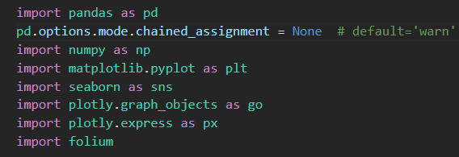

# 	Análisis de los efectos del COVID-19 en Canarias a través de la Ciencia de Datos

El objetivo de este proyecto es ver cómo ha afectado el paso del COVID-19 al turismo en Canarias. Para ello haremos uso de diferentes librerías que ofrece Python para hacer un estudio de los datos obtenidos de la encuesta de gasto turístico realizada por el Instituto Canario de Estadística

##  Requirimientos

El estudio se ha realizado en un Jupyter Notebook, el cual se puede visualizar desde el propio github accediendo al fichero main.ipynb. Pero en caso de querer usarlo de forma local, bastaría con descargar el repositorio, abrirlo en su entorno de editor de texto y ejecutarlo. Destacar que para que todo funcione se debe tener descargadas las siguientes dependencias.



## Instalación

Dichas librerías ya están seleccionadas en el fichero requirements.txt del repositorio. Solo tiene que usar el siguiente comando para instalarlas:

```
pip install -r requirements.txt
```


# Datos utilizados

Como ya se h amencionado, se han utilizado los datos recopilados por la encuesta de gasto turístico realizada por el Instituto Canario de Estadística. En conreto, se ha estudiado dichos datos a partir de su hoja de diseño y los indicadores utilizados han sido:
PAIS_RESIDENCIA
| Dato   |      Descripción      |
|----------|:-------------:|
| SEXO |  Sexo del encuestado |
| EDAD |  Edad del encuestado |
| PAIS_RESIDENCIA |  País de residencia del encuestado |
| TRIMESTRE |  Año y trimestre cuando el encuestado hizo la encuesta |
| GASTO_EUROS |  Gasto total del encuestado en su estancia, excluyendo vuelo y alojamiento|
| DESGLOSE_EXTRA_ALOJ |  Gastos extras en servicios auxiliares de alojamiento |
| DESGLOSE_PASAJES_ISLAS |  Gastos extras en pasajes entre islas |
| DESGLOSE_TAXI |  Gastos extras en taxis, transfer, VTC |
| DESGLOSE_ALQ_VEHIC |  Gastos extras en coches de alquiler y combustibles |
| DESGLOSE_TRANSP_PUBLICO |  Gastos extras en guaguas o tranvías  |
| DESGLOSE_ALIM_SUPER |  Gastos extras en  supermercados o similares |
| DESGLOSE_RESTAURANT |  Gastos extras en restaurantes, cafeterías o similares |
| DESGLOSE_EXCURS_ORGANIZ |  Gastos extras en excursiones o servicios de guía turístico |
| DESGLOSE_DEPORTES |  Gastos extras en actividades o eventos deportivas |
| DESGLOSE_ACTIV_CULTURAL |  Gastos extras en actividades o espectáculos culturales |
| DESGLOSE_MUSEOS |  Gastos extras en museos o similares |
| DESGLOSE_PARQUES_OCIO |  Gastos extras en parques de ocio o atracciones |
| DESGLOSE_DISCOTECAS |  Gastos extras en discotecas y pubs |
| DESGLOSE_SALUD |  Gastos extras en SPAs, tratamiento de belleza o salud |
| DESGLOSE_SOUVENIRS |  Gastos extras en compras no alimenticias |
| DESGLOSE_BIENES_INMUEBLES |  Gastos extras en bienes inmuebles |
| DESGLOSE_OTRAS_COMPRAS |  Gastos extras en otras compras de valor |
| DESGLOSE_FARMACIA |  Gastos extras en gastos médicos, farmacéuticos |
| DESGLOSE_OTROS_GASTOS |  Gastos extras en otrs tipos de gastos |
| NOCHES_LZ |  Número de noches en Lanzarote |
| NOCHES_FV |  Número de noches en Fuerteventura |
| NOCHES_GC |  Número de noches en Gran Canarria |
| NOCHES_TF |  Número de noches en Tenerife |
| NOCHES_LG |  Número de noches en La Gomera |
| NOCHES_LP |  Número de noches en La Palma |
| NOCHES_EH |  Número de noches en El Hierro |
| NOCHES_CRUCERO |  Número de noches en Crucero |
| NOCHES |  Número de noches totales en Canarias |
| PRIMERA_VISITA_CANARIAS |  Indica si es su primera visita a Canarias |


# Herramientas utilizadas:

1) Python como principal lenguaje

2) Pandas

3) NumPy

4) Matplolib

5) Seaborn

6) Plotly

7) Folium

8) [Geojson.io](https://geojson.io/) (Web para generar .json con las coordenadas de Canarias)
